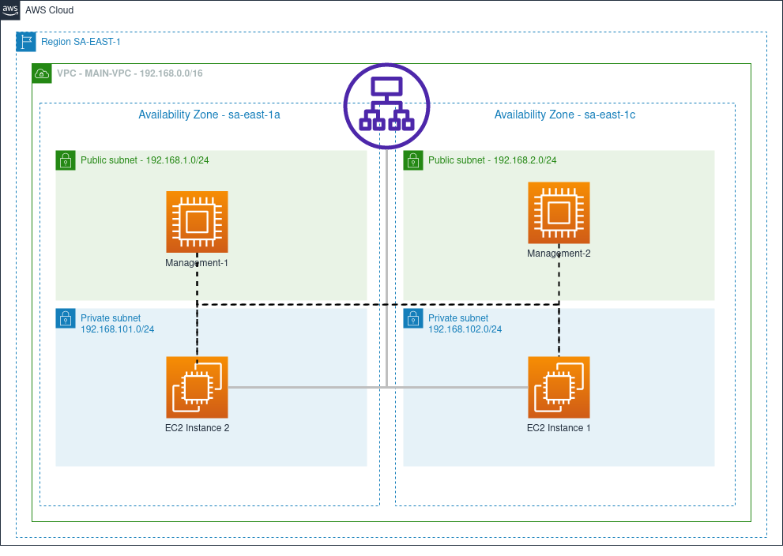

# terraform-app-load-balance

In this terraform/aws script we build a setup with an application load balancer. We will end up with following resources:

  - one app load balancer that redirect traffic to two private subnets
  - two management instances each in a different public subnet that can be used with Ansible and/or another config. tool
  - two webserver instances each in a different private subnet that will respond to the load balancer requests
  
*NAT Gateways, Routers, Databases were abstract from the design but are necessary

  

Prerequisites
-----------------------
  - Terraform
  - AWS CLI
   
Installation && Running
-----------------------

1) Do a git clone of the project:

		git clone https://github.com/dcc6fvo/terraform-app-load-balance
	
2) Change key info field of aws-instances with your current keys! Subs. the key_name parameter with your own from following files: ./main.tf; ./modules/main.tf; ./management.tf

3) Access the newly created folder with the git clone command and type the following command:

		terraform init

4) Then creates an execution plan, which lets you preview the changes that Terraform plans to make to your infrastructure:
  
  		terraform plan
  
5) Finally, the command that executes the actions proposed in a terraform plan (it is used to deploy your infrastructure):

		terraform apply -auto-approve

To destroy all the configurations:

		terraform destroy
